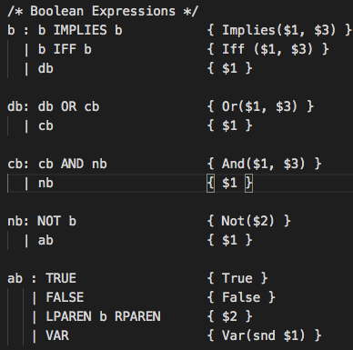
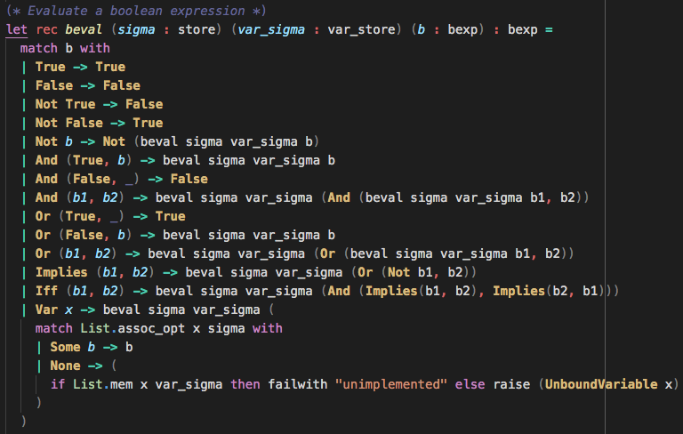

# CS4110 Project Alpha Blog Post
by Reed Freling and Samuel Levenson

## Vision

For our project, we wanted to create an interpreter for a [modal logic](https://plato.stanford.edu/entries/logic-modal/) domain specific  
language and to prove the correctness of our implementation using the proof assistent [Coq](https://coq.inria.fr/).

Our language would first include the necessary components of propositional logic, such as  
basic logical connectives and propositional variables. Then we would add the two basic  
modal logic operators, &#x25a1; and &#x25c7;. We also wanted to give the user the ability to define a  
[Kripke Model](https://en.wikipedia.org/wiki/Kripke_structure_(model_checking)) and to check the validity of modal logic expressions on a given model.

Example Diagram Representing A Kripke Model

[image source](https://en.wikipedia.org/wiki/Kripke_structure_(model_checking))

## Status

During the Alpha phase of the project, implemented most of the propositional logic part of our  
language. To begin, we defined the small-step operational semantics. We also set up parsing,  
lexing, and the interpreter up to the point of propositional logic. Originally, we also intended to  
implement the ability for the user to define propositional variables without assigning them to a  
propositional formula, but we did not finish this part duing the Alpha phase.

Code snippets from parser

Code snippets from interpreter

## Next Steps

Next, we hope to add modal logic functionality to our language. We expect that this will take most  
of the Beta phase, and possible some of the Final phase. If we have time during the final phase we  
will also prove the correctness of our operational semantics in Coq.