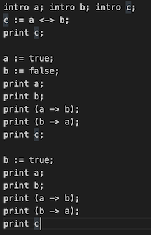
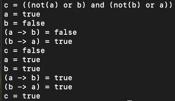
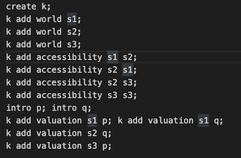
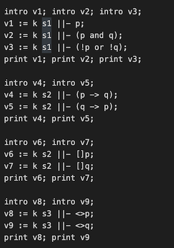
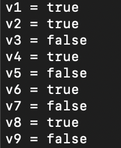

# CS4110 Project Beta Blog Post
by Reed Freling and Samuel Levenson

## Vision

For our project, we wanted to create an interpreter for a [modal logic](https://plato.stanford.edu/entries/logic-modal/) domain specific  
language and to prove the correctness of our implementation using the proof assistent [Coq](https://coq.inria.fr/).

Our language would first include the necessary components of propositional logic, such as  
basic logical connectives and propositional variables. Then we would add the two basic  
modal logic operators, &#x25a1; and &#x25c7;. We also wanted to give the user the ability to define a  
[Kripke Model](https://en.wikipedia.org/wiki/Kripke_structure_(model_checking)) and to check the validity of modal logic expressions on a given model.

Example Diagram Representing A Kripke Model

[image source](https://en.wikipedia.org/wiki/Kripke_structure_(model_checking))

## Status

The first thing we worked on during this phase of the project was implementing propositional logic functionality.  

  

Above on the left is the user input to the interpreter, and above on the right is the output of the print statements.  
Propositional variables can be introduced without a truth value. For example, initially `a` and `b` are undefined.  
Propositional variables can also be defined in terms of other propositional variables, including undefined variables.  
For example, `c` is defined in terms of `a` and `b` even though they are undefined and as a result the value of  
`c` is defined only up to the point of `a` and `b`. Later, when `a` and `b` are fully defined, expressions that consist  
of them are able to be fully evaluated. For example, `c` is now able to be evaluated down to true/false. Finally, the  
values of `a` and `b` can be changed and the value of `c` will be updated to reflect these changes.  

The second thing we worked on was implementing modal logic functionality, including giving the user the ability  
to self define a Kripke model. A Kripke model can be defined as a triple `M = (W, R, V)` where `W` is a set of states,  
`R` is the accessibility relation between the states which defines which states are "visible" from other states, and  
`V` is the truth valuation function which defines which propositional variables are true at a given state in the model.

  

The above screenshot shows the user input necessary to define the example Kripke model from seen above.  
The user can add states using the command `m add world w` where `m` is the name of the Kripke model and `w` is the  
name to assign to the world. The user can add to the accessibility relation using the command `m add accessibility w1 w2`  
where `m` is the Kripke model and `w1` should see `w2`. The user can add to the truth valuation function using the command  
`m add add valuation w p` where `m` is a Kripke model, `p` is a propositional variable that has been introduced into the  
global context, and `w` is a state where `p` should be true.  

In order to interact with a Kripke model you have defined, there is a different set of commands.  

  

The left picture demonstrates how a user might interact with a Kripke model that they have defined, and the picture on the right  
shows the output of their interaction. For example, the user can check the value of the expression at a specified state within  
a Kripke model using the command `m w ||- e` where `m` is the Kripke model, `w` is the state, and `e` is the expression. The  
expression can contain either of the two basic modal operators, &#x25a1; and &#x25c7;, written `[]` and `<>` respectively in our  
language.

## Next Steps

During the final phase of the project, we hope to simplify and partially extend the modal functionality of our language,  
particularly with regards to how the user is able to self define Kripke models. For example, we would like for the user to be  
able to add sets of worlds to a Kripke model, as opposed to only one at a time.  

We also want to partially prove the correctness of some key parts of our interpreter using the proof assistent Coq. We intend  
to focus mostly on proving the correctness of the propositional logic functionality. Whereas for the modal functionality, we  
intend to continue to write unit test type programs in order to check the correctness of our implementation.